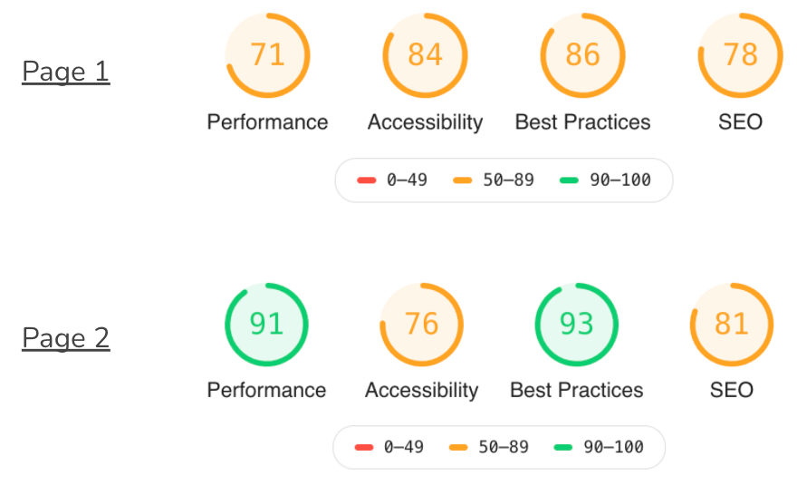
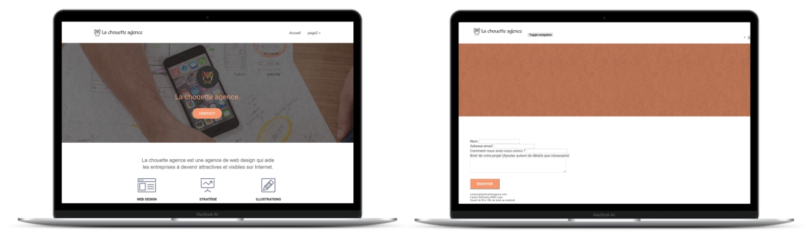
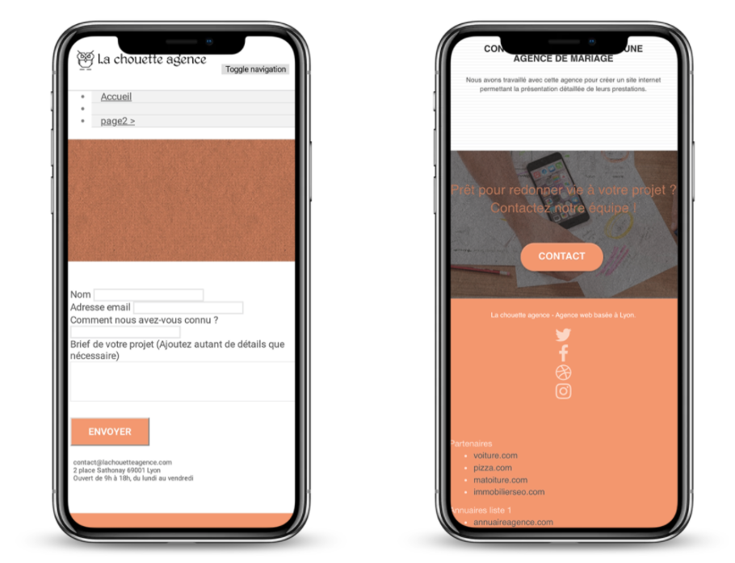
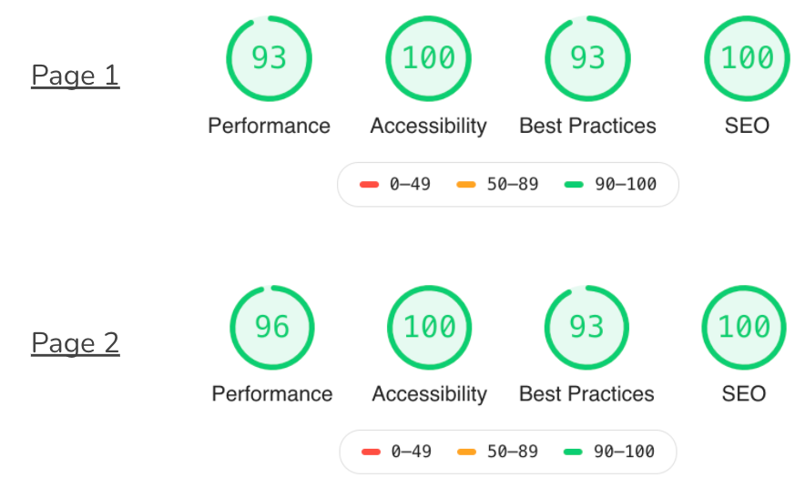

# Optimization of an existing website

## What is this project ?

This is the Project number 4 of the OpenClassrooms' Web Developer course, in which I had to optimize an existing website :
- [Initial website](https://marieparet.github.io/chouette-initial/)
- [Optimized website](https://marieparet.github.io/la-chouette-agence/)

## What did I learn ?

This project helped me grasps the concept of SEO, Accessibility, Performance and Best Practices, and how to improve them in order to optimize a website.

## The results 

### Before (initial website) :  

- Lighthouse results :  

- Overall look :  

### After (optimized website) :  

